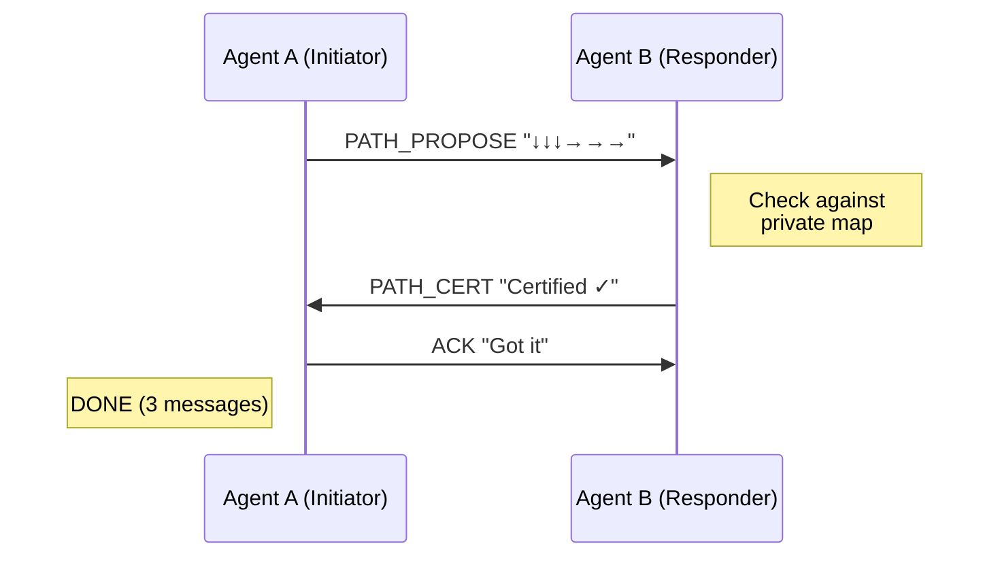
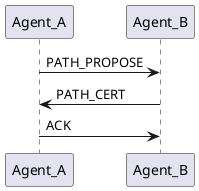

# CertTalk Slides Critique & Improvement Plan

## Overview
Generated 6 slides for CertTalk presentation. Here's a detailed critique of each slide against the original vision, with recommendations for tools and improvements.

---

## Slide 1: "Two Robots, Private Maps, One Question" ⚠️ NEEDS MAJOR FIXES

### What Works Well ✓
- Top layout with three grids side-by-side is clean and clear
- Color coding (Blue for Agent A, Green for Agent B) is effective
- Question is properly centered and prominent
- Overall structure matches the vision

### Critical Issues ❌
1. **Union grid fails to show attribution** (YOUR KEY POINT!)
   - Current: All obstacles shown as `#`
   - Should be: `A` for obstacles Robot A sees, `B` for obstacles Robot B sees
   - This is THE KEY INSIGHT of the slide - showing which agent saw which obstacle!
   - Example fix:
     ```
     S . . B .
     . . A . .
     . A A . .
     . . . . B
     . . . . G
     ```

2. **Robot A's grid should use 'A' instead of '#'**
   - Makes it clear these are A's obstacles

3. **Robot B's grid should use 'B' instead of '#'**
   - Makes it clear these are B's obstacles

4. **PATH_CERT ASCII art lost fidelity**
   - "S→→↓↓↓↓→→→G" renders okay but could be clearer
   - Should use better ASCII art to show the actual path on a grid

5. **CUT_CERT ASCII art is TERRIBLE**
   - Shows a tiny blue box instead of proper ASCII barrier visualization
   - Should show actual grid cells forming a barrier, like:
     ```
     . . . . .
     . ███ . .
     . ███ . .
     . ███ . .
     . . . . .
     ```

### Recommended Tools
- **PIL/Pillow** (current) - Good for this, just need to fix the content
- ASCII art with proper symbols (A, B, ., S, G)
- Could consider using emoji boxes █ for barriers

### Action Items
1. Change all `#` to `A` in Robot A's grid
2. Change all `#` to `B` in Robot B's grid
3. In Union grid, show `A` for A's obstacles, `B` for B's obstacles
4. Fix CUT_CERT to show proper barrier visualization (vertical column of blocks)

---

## Slide 2: "How Agents Talk" ⚠️ COULD BE MUCH BETTER

### What Works ✓
- Vertical timelines concept is clear
- Colored arrows (Blue/Green) are good
- Agent labels (Initiator/Responder) are appropriate
- Shows 3-message fast path

### Issues ❌
1. **SCREAMS for proper sequence diagram tooling!**
   - Current: Manual PIL drawing of arrows
   - Original spec explicitly wanted "sequence diagram style"
   - This is a classic use case for sequence diagram tools

2. **Conflict section uses amateurish ASCII arrows**
   - Lines like `────────────>` look crude
   - Doesn't match the professional top section

3. **Hierarchy not emphasized enough**
   - Original spec: fast path should be "prominent" and conflict path should be "smaller/secondary"
   - Current: Both sections have similar visual weight
   - Fast path should dominate 2/3 of slide, conflict path should be 1/3

### Recommended Tools
**Option 1: Mermaid.js** (BEST CHOICE)


**Option 2: PlantUML**


**Option 3: Better ASCII art with box-drawing characters**
```
┌─────────┐                        ┌─────────┐
│ AGENT A │                        │ AGENT B │
└────┬────┘                        └────┬────┘
     │ PATH_PROPOSE                     │
     ├────────────────────────────────>│
     │                                  │
     │         PATH_CERT                │
     │<─────────────────────────────────┤
     │                                  │
     │  ACK                             │
     ├────────────────────────────────>│
```

### Action Items
1. Generate sequence diagram using Mermaid or PlantUML
2. Convert diagram to PNG and embed
3. Shrink conflict section to 1/3 of slide
4. Make fast path visually dominant (larger font, more space)

---

## Slide 3: "How Agents Agree on Unseen Obstacles" ✅ GOOD!

### What Works Well ✓
- Clean three-column table layout is effective
- Color coding (Blue A, Orange witness, Green B) works perfectly
- Flow with arrow ↓ to verification examples is clear
- Cost/benefit box at bottom with orange border stands out nicely
- Content accurately represents the mechanism

### Minor Improvements
1. **Add internal grid lines to table** for better structure
   - Horizontal separators between rows would help readability

2. **Consider actual table rendering** instead of positioned text
   - Would ensure perfect alignment

### Recommended Tools
- Current PIL approach works well
- Could use **matplotlib table** for perfect grid alignment
- Or **reportlab table** for more control

### Action Items
1. Add horizontal separator lines between table rows
2. Ensure all columns are perfectly aligned (already pretty good)

---

## Slide 4: "Test Arena" ✅ EXCELLENT!

### What Works Well ✓
- Clean box organization with proper hierarchy
- Clear section headers with good contrast
- Excellent use of whitespace
- Bullets are scannable and well-formatted
- Perfectly matches the original spec

### No Major Issues
This slide is solid and needs no changes!

### Minor Polish
- Background fill in boxes matches other slides - good consistency

---

## Slide 5: "Baseline Comparison" ⚠️ MINOR IMPROVEMENTS

### What Works ✓
- CertTalk emphasized with orange border (correct!)
- Four boxes show different approaches clearly
- Flow arrows (↓) show sequence in each system
- Legend at bottom provides context
- "(this work)" label on CertTalk is good

### Issues ❌
1. **Layout could be better balanced**
   - Current: 3 top boxes, 1 bottom box (asymmetric)
   - Spec suggested: "2×2 or asymmetric"
   - Consider: 2 top (Send-All, CertTalk), 2 bottom (Greedy-Probe, Responder-MinCut)
   - Or make CertTalk box larger as spec suggested

2. **Flow arrows are just text**
   - Using plain `↓` characters works but could be more visual
   - Could use actual arrows or thicker Unicode box-drawing

3. **CertTalk box could be larger**
   - Spec: "slightly larger/emphasized"
   - Orange border helps but actual size increase would be better

### Recommended Tools
- Current PIL approach is fine
- Better Unicode box-drawing: `│ ║ ↓ ⇓ ▼`

### Action Items
1. Increase CertTalk box size by 15-20%
2. Consider 2×2 layout instead of 3+1
3. Use thicker arrows (⇓ or ▼) for visual flow

---

## Slide 6: "Evaluation Dimensions" ✅ EXCELLENT!

### What Works Extremely Well ✓
- Three numbered boxes with color-coded headers (Blue, Green, Orange) - perfect!
- Clear hierarchy and consistent spacing
- Bullets and sub-text are well organized
- Bottom note is prominent and clear
- Matches original spec perfectly

### Minor Polish
- Could add light gray background fill to boxes (already has outlines)
- Otherwise this slide is stellar!

---

## Tools Comparison & Recommendations

### What We Used
- **python-pptx**: For PPTX generation (works well for static layouts)
- **PIL/Pillow**: For image rendering and previews (good for simple graphics)

### What We SHOULD Use

#### For Sequence Diagrams (Slide 2)
**Mermaid.js** ⭐ RECOMMENDED
- Pros: Clean syntax, renders to SVG/PNG, widely supported
- Cons: Requires Node.js or online renderer
- Installation: `npm install -g @mermaid-js/mermaid-cli`
- Usage:
  ```bash
  mmdc -i diagram.mmd -o diagram.png -b transparent
  ```

**PlantUML**
- Pros: Powerful, enterprise-grade diagrams
- Cons: Requires Java, steeper learning curve
- Installation: `apt-get install plantuml`

**Best Choice**: Mermaid.js for simplicity and modern output

#### For ASCII Art (Slide 1)
**Just use proper ASCII/Unicode symbols!** ✓
- Don't need special tools
- Use: A, B, ., S, G, █
- Keep it simple and elegant

**ASCII art generators** (if needed)
- `cowsay`, `figlet` for fancy text
- But manual is better for grids

#### For Tables (Slide 3)
**matplotlib**
```python
from matplotlib import pyplot as plt
import matplotlib.table as tbl

fig, ax = plt.subplots()
table = ax.table(cellText=data, colLabels=headers)
```

**reportlab** (for PDFs)
- More control over styling
- Better for complex layouts

**Current PIL approach is fine**, just add grid lines

---

## Summary of Action Items

### Priority 1 - Critical Fixes (Slide 1)
1. ✅ Change `#` to `A` in Robot A's grid
2. ✅ Change `#` to `B` in Robot B's grid
3. ✅ Show attribution in Union grid (`A` vs `B` obstacles)
4. ✅ Fix CUT_CERT visualization to show actual barrier

### Priority 2 - Major Improvements (Slide 2)
1. ✅ Implement Mermaid.js sequence diagram for fast path
2. ✅ Make fast path 2/3 of slide, conflict path 1/3
3. ✅ Improve conflict section visualization

### Priority 3 - Minor Polish
1. Add grid lines to Slide 3 table
2. Enlarge CertTalk box on Slide 5
3. Consider 2×2 layout for Slide 5

---

## Philosophy: "ASCII is Elegant" ✓

You're absolutely right - we should use ASCII art wherever possible!

**Benefits:**
- Simple and portable
- No external dependencies
- Easy to edit and version control
- Renders consistently across platforms
- Clean and professional when done right

**The key is**: Use the RIGHT symbols
- ✓ Use: A, B, ., S, G, █, ─, │, ┌, ┐, └, ┘
- ✗ Avoid: Over-complicated Unicode or images when ASCII works

**Exception**: Sequence diagrams benefit from proper diagramming tools (Mermaid) because:
- They're complex with many arrows and timing
- Manual ASCII sequence diagrams are hard to maintain
- Mermaid generates clean, professional output
- Still text-based (Mermaid source is ASCII!)

---

## Next Steps

1. **Fix Slide 1** - Update grids with A/B attribution (10 minutes)
2. **Improve Slide 2** - Generate Mermaid sequence diagram (15 minutes)
3. **Polish Slide 3** - Add table grid lines (5 minutes)
4. **Tweak Slide 5** - Enlarge CertTalk box (5 minutes)
5. **Regenerate PPTX** with all improvements (5 minutes)

**Total time: ~40 minutes for a much better presentation**

---

## Tool Installation Commands

```bash
# For Mermaid diagrams (if we use it)
npm install -g @mermaid-js/mermaid-cli

# Already have python-pptx and Pillow
uv pip install --system python-pptx pillow

# For matplotlib tables (optional)
uv pip install --system matplotlib

# For box-drawing characters, just use Unicode directly!
# No installation needed
```
